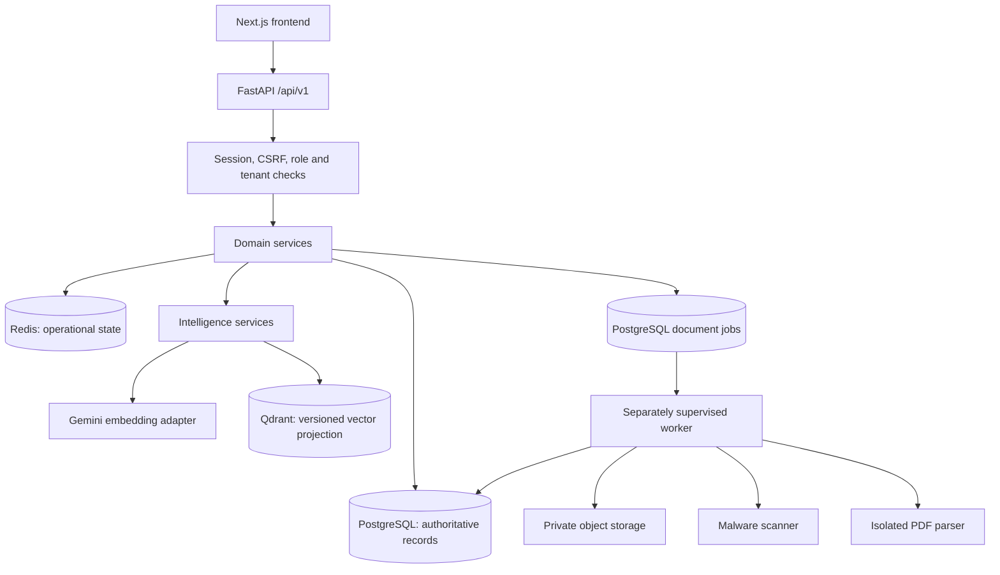
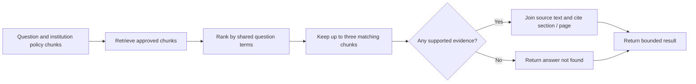
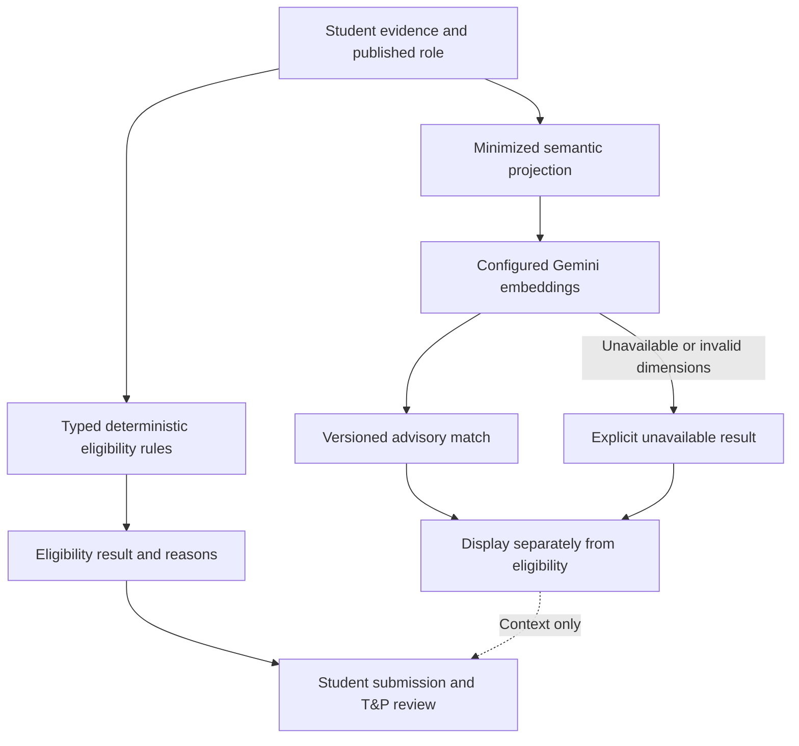
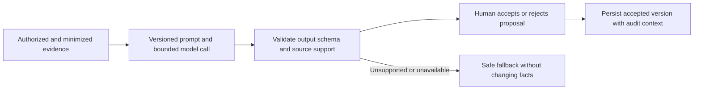

<h1 align="center">CampusHire AI · Backend</h1>

<p align="center">
  The rules, evidence, and intelligence layer for accountable campus recruitment.<br />
  <strong>FastAPI · PostgreSQL · Durable workers · Bounded AI workflows</strong>
</p>

<p align="center">
  <a href="#architecture">Architecture</a> ·
  <a href="#agentic-ai-and-generative-ai">AI walkthrough</a> ·
  <a href="#resume-processing-and-human-review">Document pipeline</a> ·
  <a href="#run-locally">Get started</a> ·
  <a href="#documentation-map">Runbooks</a>
</p>

---

CampusHire supports student preparation and institution-managed hiring: profiles, resumes, published opportunities, eligibility, applications, correction requests, and T&P review. This repository is the **source of business authority** behind the [CampusHire frontend](https://github.com/painjanevivek/CampusHire).

The service is a modular FastAPI application with a separately supervised worker, not a collection of independently deployed microservices. It exposes a versioned /api/v1 contract and keeps AI-assisted relevance separate from deterministic eligibility and human recruitment decisions.

> **Release boundary:** consult [Current Release Status](docs/CURRENT_RELEASE_STATUS.md) before promotion. The recorded decision remains synthetic qualification only, not approval for real student data. This README neither closes security findings nor grants institutional approval.

## Domain responsibilities

| Domain | Backend responsibility |
| --- | --- |
| Identity and institutions | Sessions, memberships, roles, tenant boundaries, CSRF checks, administrator MFA |
| Student profiles | Reviewed profile data and private, validated profile photos |
| Resumes | Versioned uploads, quarantine, scanning, isolated parsing, review and controlled suggestions |
| Recruitment | Companies, drives, roles, published rules, application snapshots and recorded decisions |
| Experience | Deterministic next actions, supplemental correction history, saved views, preparation and reports |
| Intelligence | Versioned semantic relevance, reviewed role extraction proposals and grounded policy evidence |
| Operations | Durable jobs, notifications, audit records, dependency states and recovery controls |

## Architecture



| Component | Owns | Does not own |
| --- | --- | --- |
| PostgreSQL | Users, memberships, profiles, application evidence, audit records and durable jobs | Model-generated truth |
| Redis | Short-lived operational concerns such as rate limits, caches and leases | The only copy of critical business records or jobs |
| Qdrant | Rebuildable embeddings with source versions and institution metadata | Authoritative profiles, policy approvals or eligibility |
| Private object storage | Original and generated resume files under controlled keys | Public access to student documents |
| Worker | Bounded document processing and durable job progress | Permission to bypass review or silently change submission evidence |
| Frontend | Presentation, user interaction and typed API consumption | Authorization or final business-rule enforcement |

Profile photos follow a separate bounded image pipeline and are stored privately in PostgreSQL; they are not resume objects or recruitment evidence. See [Profile Photos](docs/PROFILE_PHOTOS.md).

## Agentic AI and generative AI

### Understand the terms before the implementation

- **Generative AI** produces new content from model inference, such as a drafted explanation or proposed rewrite.
- **Embeddings** encode content as numeric vectors for semantic comparison; an embedding response is not generated prose.
- **Retrieval grounding** ties an answer to approved source material. Retrieval alone is not an LLM-based retrieval-augmented generation (RAG) system.
- **Agentic orchestration** coordinates steps and state toward a task. A fixed workflow can provide useful orchestration without an autonomous planning loop.
- **Human-in-the-loop review** keeps proposals distinct from accepted facts and accountable decisions.

CampusHire deliberately uses the smallest mechanism appropriate to each task. Normal CRUD, eligibility, and dashboard priorities do not run through an AI agent.

### What is implemented today

| Capability | Actual mechanism | Authority boundary / source |
| --- | --- | --- |
| Semantic relevance | Gemini embed_content, versioned source projections and matching services | Advisory only; [provider adapter](app/ai/providers/gemini.py), [intelligence service](app/modules/intelligence/service.py) |
| Policy explanation | Fixed LangGraph retrieval/explanation steps over approved chunks | Returns cited source text or no evidence; [workflow](app/ai/workflows/policy_explanation.py) |
| Resume extraction | Bounded text parsing and rule-based field extraction | Proposed data requires review; [pipeline](app/modules/resumes/pipeline.py) |
| Resume wording suggestions | Conservative deterministic wording transformations | No invented outcomes or metrics; explicit student acceptance |
| Role extraction proposals | Proposal/review workflow in intelligence services | An authorized reviewer must approve before a draft role changes |
| Role-specific preparation | Reviewed profile/resume evidence and approved roadmap mappings | No automatic provider call on page visit; absent mappings remain explicit |
| Next-action guidance | Ordered server-side priority rules | Not model planning and not an autonomous agent |

**Do not describe the current implementation as an autonomous recruiting agent or a general-purpose generative chatbot.** The inspected Gemini provider implements embeddings; the policy graph does not call a text-generation model.

### The actual LangGraph policy workflow



The compiled graph has two nodes, retrieve and explain, with START → retrieve → explain → END. Ranking and the empty-evidence branch above expand the work inside those nodes; they are not additional graph nodes. State carries the question, chunks, citations, answer, and iteration count. Retrieval excludes unapproved chunks and uses lexical overlap, not vector search. This finite path is inspectable and has no autonomous tool execution or recursive planning loop.

### Semantic relevance is not eligibility



The student embedding projection excludes explicit identity/contact fields such as name, email, phone, PRN, institution identifiers, and external links. Free-text evidence can still be sensitive; field minimization is not a claim of anonymization. Provider configuration and data handling require appropriate review.

Source revisions and model metadata identify a match. Successful fingerprints are cached; failed attempts have a 60-second negative-cache cooldown before a normal request can retry. Dashboard reads do not call the provider. A missing provider or failed vector operation cannot rewrite formal eligibility. See [Reviewed Intelligence Boundary](docs/INTELLIGENCE_BOUNDARY.md).

### Where generative AI could be added — not implemented here

A future model-backed rewrite or policy-summary service could fit inside these existing review boundaries:



This is an **extension design**, not the current runtime. It would require implementation, groundedness and failure evaluations, provider/privacy approval, timeout and cost controls, and tests proving that generated content cannot fabricate qualifications or bypass eligibility. LangGraph and a model SDK being installed do not establish those capabilities.

## Resume processing and human review

```mermaid
sequenceDiagram
    actor Student
    participant API as FastAPI
    participant DB as PostgreSQL
    participant Storage as Private storage
    participant Worker
    participant Scanner
    participant Parser as Isolated parser
    Student->>API: Upload resume
    API->>Storage: Store under quarantine key
    API->>DB: Create version and durable job
    API-->>Student: 202 and job identifier
    Worker->>DB: Claim job with bounded lease
    Worker->>Storage: Read quarantined bytes
    Worker->>Scanner: Scan bytes
    alt Clean scan
        Worker->>Parser: Parse within resource limits
        alt Valid parse
            Worker->>Storage: Promote to private clean storage
            Worker->>DB: Save proposed extraction and suggestions
            Student->>API: Review extraction and accept or reject suggestions
            API->>DB: Record reviewed version and explicit decisions
        else Unsafe or invalid document
            Worker->>DB: Record failure; keep unavailable for use
        end
    else Infected or scanner unavailable
        Worker->>DB: Fail closed or retry within bounded budget
    end
```

Durable job states include queued, processing, cancellation_requested, completed, failed, and cancelled. A completed processing job is not the same as a student-reviewed resume. Worker leases, retries, and idempotency protect processing; explicit ownership and clean-file checks protect downloads.

Development's marker scanner and subprocess parser are **not production security controls**. Staging/production require ClamAV and an approved container-parser setup. Read [Resume Pipeline](docs/RESUME_PIPELINE.md) and [Parser Sandbox](docs/PARSER_SANDBOX.md).

## Application evidence and accountable review

An application records the submitted profile, resume, rule and eligibility context. A later correction response is supplemental, never a silent replacement of those snapshots.

1. T&P creates instructions and an optional response deadline.
2. The student replies with text and, optionally, an owned, clean, reviewed resume version.
3. T&P resolves, requests another response, or cancels the request.
4. History retains actor and timestamp. Late responses remain possible while a request is open.
5. Terminal application outcomes close outstanding requests with a recorded reason.

New review interfaces supply expected revisions to reject stale writes. Bulk previews do not authorize later changes by themselves: confirmation revalidates the selected records. Request resolution does not automatically change application status or eligibility. Appeals remain separate.

## Run locally

Prerequisites: Python 3.11 or newer as declared in [pyproject.toml](pyproject.toml), Docker for the provided local services, and a separate terminal for the worker. Examples use PowerShell from this repository root.

### 1. Install and configure

```powershell
# Copy only if .env does not already exist; preserve local secrets/settings.
Copy-Item .env.example .env
python -m venv .venv
.\.venv\Scripts\Activate.ps1
python -m pip install -e ".[dev]"
docker compose up -d postgres redis
python -m alembic upgrade head
```

If activation is blocked by local shell policy, use .\.venv\Scripts\python.exe directly instead of weakening that policy. The Compose credentials are local development defaults, not production credentials. An existing compatible local PostgreSQL/Redis setup can be used instead; avoid starting a second service on occupied ports.

### 2. Start the API and worker

```powershell
python -m uvicorn app.main:app --reload --host 127.0.0.1 --port 8000
```

In a second terminal, activate the same environment, then:

```powershell
python -m app.worker
```

The API base is [localhost:8000/api/v1](http://localhost:8000/api/v1). The default development parser is subprocess. To exercise the Docker parser locally, build its image and configure RESUME_PARSER_BACKEND=docker according to the parser runbook:

```powershell
docker build -f Dockerfile.parser -t campushire-pdf-parser:local .
```

### 3. Optional semantic matching

Start the configured vector service and supply your own backend-only GEMINI_API_KEY:

```powershell
docker compose up -d qdrant
```

Without the configured provider, expect semantic relevance to be unavailable; this is not a reason to fabricate a match. Local core workflows and deterministic extraction do not require enabling a text-generation service. External provider usage may have costs; no free-tier or capacity guarantee is implied.

### Configuration map

Use [.env.example](.env.example) as the complete configuration reference. Never commit .env, private keys, API keys, session data, or real student fixtures.

| Settings | Purpose |
| --- | --- |
| APP_ENV, PROCESS_ROLE | Environment validation and API/worker process responsibilities |
| DATABASE_URL, DATABASE_POOL_* | PostgreSQL connection and bounded pool settings |
| REDIS_URL, REDIS_MAX_CONNECTIONS | Operational Redis access and connection budget |
| FRONTEND_ORIGINS, TRUSTED_HOSTS | Exact allowed browser origins and API host validation |
| SESSION_*, CSRF_COOKIE_NAME | Server-side session and CSRF configuration |
| RESUME_STORAGE_*, OCI_* | Private local/OCI object storage configuration |
| MALWARE_SCANNER, CLAMAV_*, RESUME_PARSER_* | Document scanning and parser isolation |
| GEMINI_API_KEY, GEMINI_EMBEDDING_MODEL, QDRANT_URL | Optional embedding and vector integration |
| EMAIL_* | Delivery provider, quotas and reminder configuration |

For frontend http://127.0.0.1:3002 and backend port 8001, configure:

```dotenv
APP_PORT=8001
FRONTEND_ORIGINS=["http://127.0.0.1:3002"]
```

```powershell
python -m uvicorn app.main:app --reload --host 127.0.0.1 --port 8001
```

Point both frontend API variables to http://127.0.0.1:8001/api/v1. Keep hostname, cookie, origin, and HTTPS configuration aligned; do not relax CSRF to work around a mismatched setup.

### Synthetic demo accounts

For development/test only:

1. Set DEMO_LOGIN_ENABLED=true in backend .env.
2. Supply DEMO_STUDENT_EMAIL, DEMO_STUDENT_PASSWORD, DEMO_ADMIN_EMAIL, and DEMO_ADMIN_PASSWORD privately.
3. Run `python scripts/seed_demo_accounts.py`.
4. Enable the frontend's server-only DEMO_LOGIN_ENABLED flag to display its buttons.

The demo endpoint chooses credentials server-side; passwords are not sent to the browser. Set DEMO_ADMIN_MFA_BYPASS=true only for an intentional synthetic local/test session. The bypass is audited, normal administrator sign-in still requires MFA, and staging/production reject demo authentication.

## Code map and API contract

### Technology stack

| Layer | Repository choice |
| --- | --- |
| HTTP and validation | Python, FastAPI, Pydantic settings, Uvicorn |
| Persistence and migrations | PostgreSQL, async SQLAlchemy, asyncpg, Alembic |
| Operational and vector stores | Redis and Qdrant clients |
| Intelligence | Google Gen AI embedding adapter and LangGraph |
| Document and image processing | PyMuPDF, isolated parser adapters, Pillow |
| Private object storage | Local development adapter and OCI integration |
| Verification | pytest, Ruff, strict MyPy, contract and evaluation scripts |

Exact dependency versions are declared in [pyproject.toml](pyproject.toml). This list describes repository dependencies, not a requirement to enable every external integration for local core workflows.

```text
app/
├── api/v1/routes/   Thin HTTP handlers and versioned endpoints
├── modules/         Domain services, schemas and workflows
├── models/          Persistence models
├── ai/              Provider adapter and bounded LangGraph workflow
├── core/            Shared configuration and middleware
└── worker.py        Durable background process entry point
migrations/          Additive Alembic schema history
openapi/             Reviewed API contract snapshot
tests/               Unit and integration regressions
scripts/             Seeds, contract export, evaluation and operational tools
docs/                Boundaries, release status, evidence and runbooks
```

The [OpenAPI snapshot](openapi/campushire.openapi.json) is the contract authority. For a contract change:

1. Update backend schemas/routes and focused tests.
2. Run `python scripts/export_openapi.py` and review the diff.
3. Copy the reviewed snapshot to the frontend openapi/ directory.
4. Run frontend `npm run api:generate` and verify compatibility.
5. Deploy compatible backend changes before frontend consumers.

Do not hand-maintain a competing set of frontend transport types. See [API Contract Governance](docs/API_CONTRACT.md).

## Verification and evaluation

```powershell
python -m pytest
python -m ruff check .
python -m mypy app
python -m alembic check
python scripts/export_openapi.py
python scripts/evaluate_matching.py
```

These are commands to run, not claimed results for the current checkout. Migration drift checks need the intended database; recorded local evidence identifies older constraint/index differences that must not be removed just to manufacture a passing check.

For AI-related changes, verify source grounding, unavailable-provider behavior, tenant isolation, immutable application evidence, student review, and model/source version handling. For any future generative service, add unsupported-claim and adversarial-input evaluation before treating its output as useful.

Read [Scaling](docs/SCALING.md) for bounded pool and query work. Local request/concurrency smoke tests and warm-navigation measurements establish only their documented laboratory behavior; they do not prove 1,000 concurrent users on an unspecified production host.

## Deployment boundaries

The HTTP API has a Vercel Python Function deployment path, but **the complete document-processing system is not hosted by that function alone**. The durable worker, ClamAV and container parser need separately supported always-on infrastructure. Follow [Vercel Deployment](docs/VERCEL_DEPLOYMENT.md) for process roles, PostgreSQL pooling, OCI private storage and credentials.

Before real-data promotion, the named candidate pair needs the applicable security, migration, recovery, capacity, staging, privacy and institutional approval evidence. An old scan or a passing unit suite cannot replace these gates. Keep newly recorded requests and evidence when rolling back compatible application versions.

## Documentation map

| Topic | Source |
| --- | --- |
| Current authority | [Release status](docs/CURRENT_RELEASE_STATUS.md), [Release gates](docs/RELEASE_GATES.md) |
| Architecture and tenant ownership | [Architecture baseline](docs/ARCHITECTURE_BASELINE.md), [Frontend architecture decisions](https://github.com/painjanevivek/CampusHire/blob/main/docs/ARCHITECTURE_DECISIONS.md) |
| AI and evidence | [Intelligence boundary](docs/INTELLIGENCE_BOUNDARY.md), [Resume pipeline](docs/RESUME_PIPELINE.md), [Parser sandbox](docs/PARSER_SANDBOX.md) |
| Product workflows | [Product experience upgrade](docs/PRODUCT_EXPERIENCE_UPGRADE.md), [Profile photos](docs/PROFILE_PHOTOS.md) |
| Security and privacy | [Security policy](SECURITY.md), [Threat model](docs/THREAT_MODEL.md), [Privacy](docs/PRIVACY.md) |
| Operations | [Runbooks](docs/RUNBOOKS.md), [Observability](docs/OPERATIONS_AND_OBSERVABILITY.md), [Recovery](docs/DEPLOYMENT_RECOVERY.md) |
| Deployment and scale | [Vercel](docs/VERCEL_DEPLOYMENT.md), [Staging](docs/STAGING_DEPLOYMENT.md), [Scaling](docs/SCALING.md) |

Historical reports retain their original dates and candidate scope. This documentation update does not rerun a security scan, close a release gate, or update external approvals.

---

**The central boundary:** AI can assist with evidence and proposals; deterministic rules and authorized people remain accountable for consequential decisions.
