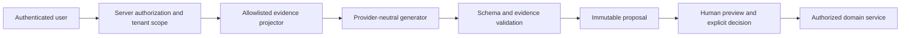

# CampusHire — AI Product and Authority Boundaries

Status: implementation baseline; formal approval pending.

Approvers: `[FILL: Product Owner]`, `[FILL: Security/Privacy Approver]`,
`[FILL: T&P Domain Owner]`.

Release thresholds: `[FILL: groundedness target]`, `[FILL: citation accuracy target]`,
`[FILL: unsupported-claim maximum]`, `[FILL: p95 latency target]`, and
`[FILL: per-tenant monthly budget and approved Gemini price sheet]`. Cross-tenant leakage and
unauthorized state changes are fixed at zero and are not configurable.

## Non-negotiable decisions

- The eligibility engine and the existing policy LangGraph workflow are frozen. AI can explain
  their outputs, but cannot replace or reinterpret them.
- AI may read authorized evidence, explain, draft, and recommend. It may never approve, reject,
  publish, shortlist, rank candidates, or mutate a domain record without an explicit user action.
- Every AI change is persisted first as a proposal. A user must preview it and explicitly accept,
  edit, or reject it. Publishing and sending remain separate authorized domain actions.
- T&P registrations require institutional email verification and CampusHire operator approval.
- Student activation requires an invitation, approved roster match, or a uniquely verified domain
  owned by an active institution. Role and tenant are always derived by the backend.
- New resume uploads are prohibited. Resumes are built from reviewed profile evidence and accepted
  as immutable generated versions.

## Authority matrix

| Action | Student | T&P member | T&P owner | Operator | AI |
|---|---:|---:|---:|---:|---:|
| Edit own profile | Yes | No | No | No | Proposal only |
| Accept own AI proposal | Yes | No | No | No | No |
| Draft role/rule/message | No | Yes | Yes | No | Proposal only |
| Approve a proposal | No | Permission-based | Permission-based | No | No |
| Publish/send | No | Existing permission | Existing permission | No | No |
| Activate institution | No | No | After verified onboarding | Verify registration | No |
| Decide eligibility/shortlist | No | Existing deterministic workflow | Existing deterministic workflow | No | Never |

## Data and privacy boundary

Model requests use an allowlisted evidence projection. Direct identifiers—including email, phone,
PRN/enrollment number, invitation tokens, IP address, and session data—are excluded. Generated
claims carry evidence references and a digest of the supplied evidence. Provider credentials stay
backend-only. Logs contain identifiers, timings, safe error codes, and usage totals, never raw
prompts, chain-of-thought, or message bodies.

Unaccepted Copilot conversations expire after 30 days. Accepted artifacts follow the retention
policy of their destination domain. Cross-institution access and unauthorized state changes are
release-blocking failures with a required evaluated result of zero.

## Trust-boundary flow

Feature flags: `ai_generation`, `ai_resume_studio`, `student_copilot`, and `tnp_copilot`. A provider
failure or disabled flag must leave registration, onboarding, eligibility, applications, and manual
resume generation operational.
