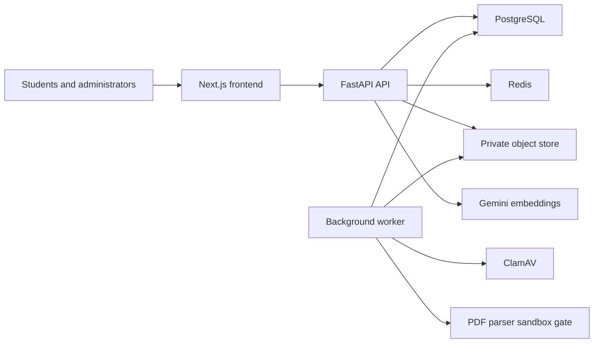

# CampusHire threat model

## Executive summary

CampusHire's highest-impact risks are cross-tenant placement-data access, compromise of the PDF worker through an untrusted document, integrity loss in eligibility or application decisions, and disclosure or abuse at the external AI boundary. The implementation provides server-derived tenant context, role and ownership checks, CSRF-protected mutations, immutable decision snapshots, private file storage, reviewed AI output, and PII-minimized semantic matching. Credential-free PDF parser isolation remains a hard gate before real student uploads.

## Scope and assumptions

This model covers the Next.js runtime and API client, FastAPI application, database migrations, background worker, private object storage, Redis coordination, and external AI calls. Build output, local fixtures, and provider-specific cloud controls are out of scope.

The pilot is assumed to be internet-facing and institution-scoped, with secure cookie sessions and sensitive student profile, resume, academic, and application data. Production dependencies must be private, least-privileged, and independently recoverable. Institutional retention, incident, appeal, and accessibility owners still require named approval.

## System and trust boundaries

- Internet to Next.js: nonce CSP, browser security headers, React escaping, and safe internal-link checks.
- Browser to FastAPI: strict origins, SameSite cookies, session-bound CSRF, typed schemas, upload limits, and rate budgets.
- Principal to tenant services: role dependencies and server-derived institution identifiers scope every protected query.
- PDF quarantine to parser: files are bounded and scanned, but native parsing must move to a credential-free sandbox.
- Services to durable stores: opaque keys, path containment, transactions, leases, and audit events protect authoritative data.
- Evidence projection to Gemini: contact and identity fields are excluded, input is bounded, calls are budgeted and timed out, and output cannot decide eligibility.

## Assets and security objectives

| Asset | Objective |
| --- | --- |
| Session and CSRF secrets | Confidentiality and integrity |
| Student profile, resume, academic, and application data | Confidentiality, integrity, and availability |
| Rules, decisions, overrides, and audit history | Integrity and availability |
| Database, object-store, and provider credentials | Confidentiality, integrity, and availability |
| Worker/API capacity and provider quota | Availability |
| OpenAPI and release artifacts | Integrity |

## Threats and controls

| ID | Abuse path and impact | Existing controls | Remaining mitigation | Priority |
| --- | --- | --- | --- | --- |
| TM-001 | Crafted PDF exploits or exhausts the native parser. | Quarantine, MIME/size/page limits, ClamAV, ephemeral credential-free parser image, stdin-only input, bounded output, no network, read-only root, dropped capabilities, resource/time limits, abuse tests, and selected shared-VM rootless-launcher evidence. | Re-run the policy test before any launcher/provider migration and before admitting real student uploads. | Medium deployment condition |
| TM-002 | A principal substitutes another tenant's object identifier, exposing or changing placement data. | Server-derived institution context, role/ownership dependencies, scoped repository queries, negative authorization tests, and shared-VM tenant-negative smoke. | Preserve the IDOR matrix for every candidate route. | Low |
| TM-003 | A malicious origin submits a credentialed mutation. | Secure SameSite cookie policy, allowed-origin validation, session-bound double-submit CSRF, revocable sessions, and public HTTPS deployment smoke. | Revalidate origin/cookie configuration after domain or gateway changes. | Low |
| TM-004 | Match requests exhaust provider quota or create uncontrolled cost. | CSRF-protected POST, fingerprint cache, per-principal/institution Redis budget, provider timeout, production fail-closed behavior. | Approve staging quotas, concurrency, cost alerts, and SLOs. | Medium |
| TM-005 | An administrator publishes incorrect rules or abuses an override. | Immutable rule/application snapshots, reason and policy reference, permission checks, status history, audit events, manual review. | Institutional approval matrix and four-eyes policy for high-impact changes. | Medium |
| TM-006 | External AI receives unnecessary PII or influences an authoritative outcome. | Minimized evidence projection, reviewed extraction, bounded prompts, provider metadata, deterministic eligibility separation. | Provider DPA, region, retention, and egress approval. | Medium |
| TM-007 | Stored API content navigates a user to an unsafe destination or injects script. | React escaping, nonce CSP, relative API paths, internal-link validation, unsafe-link tests. | Maintain HTTPS allowlists for intentional external company links. | Low |
| TM-008 | Database, queue, object-store, or operator failure causes data loss or inconsistent recovery. | PostgreSQL authority, durable jobs, idempotency, leases, runbooks, local full fault matrix, and selected shared-VM timed restore/rollback/outage evidence. | Repeat the rehearsal before a provider/topology migration and approve institutional RTO/RPO. | Medium |

## Security review focus

- `app/modules/auth/dependencies.py`: session, role, and tenant root controls.
- `app/api/v1/routes/resumes.py`: attacker-controlled file entry and owner-only download.
- `app/modules/resumes/pipeline.py` and `app/modules/resumes/service.py`: scan, parse, and job-state boundary.
- `app/modules/recruitment/service.py`: immutable eligibility and application decisions.
- `app/api/v1/routes/intelligence.py`: provider trigger, CSRF, and budget control.
- `app/modules/privacy/service.py`: destructive deletion and retention boundary.
- `.github/workflows/ci.yml`: contract, migration, dependency, and release integrity.

## Review status

The standard backend scan found no critical/high source issue and its semantic-provider-budget finding was remediated. Phase 7A removed the hostile PDF source-to-sink path from the privileged worker and confined uploaded-byte parsing to the tested credential-free container policy; PyMuPDF remains only for deterministic output generation from reviewed structured fields. Selected shared-VM reproduction passes. The later separate frontend/backend Deep Security Scans completed and sealed on 2026-08-28; all validated findings were remediated and regression-tested as recorded in `docs/PHASE10_SECURITY_CLOSURE_2026-08-28.md`. No validated critical/high issue remains. External infrastructure, governance, and representative-user gates remain outside source review.
